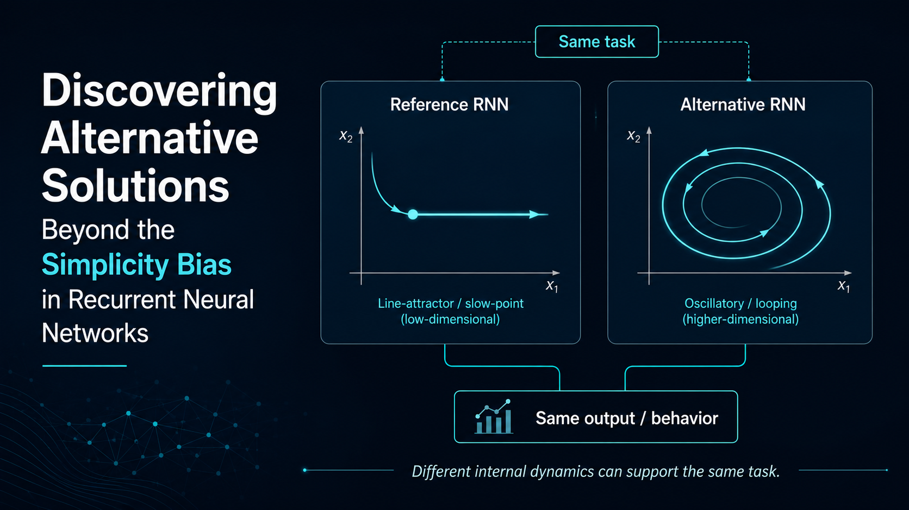

  

# Discovering Alternative Solutions Beyond the Simplicity Bias in Recurrent Neural Networks

This repository contains presentation materials for the ICLR 2026 paper:

**“Discovering Alternative Solutions Beyond the Simplicity Bias in Recurrent Neural Networks”**  
William Qian & Cengiz Pehlevan

The presentation focuses primarily on the **methodological contribution** of the paper: Iterative Neural Similarity Deflation (INSD), a training procedure designed to uncover alternative recurrent neural network solutions that solve the same task using different internal dynamical mechanisms.

---

## Motivation

Task-trained recurrent neural networks are widely used in computational neuroscience to generate hypotheses about how neural circuits may implement cognitive computations.

However, independently trained RNNs can converge to effectively the same low-dimensional dynamical solution, even when initialization seeds or gains differ. This phenomenon is referred to as **dynamic collapse**.

The central question is therefore:

> **Can the same task be solved by fundamentally different recurrent dynamics?**

---

## Iterative Neural Similarity Deflation

INSD searches for alternative RNN solutions while preserving task performance.

A reference RNN is first trained using the ordinary task objective:

$$
L_{\mathrm{ref}} = L_{\mathrm{task}}
$$

Subsequent RNNs are trained with an additional similarity penalty:

$$
L_{\mathrm{alt1}}
=
L_{\mathrm{task}}
+
\lambda S(R_{2\perp}, R_{1\perp})
$$

Later alternatives are penalized against all previously discovered solutions. For example:

$$
L_{\mathrm{alt2}}
=
L_{\mathrm{task}}
+
\lambda
\left[
S(R_{3\perp}, R_{1\perp})
+
S(R_{3\perp}, R_{2\perp})
\right]
$$

The basic idea is:

**same task → different internal dynamics**

---

## Why the Readout Nullspace?

Neural activity can be separated into:

- **Output-potent activity** — directly contributes to the required task output.
- **Readout-null activity** — does not directly affect the output.

For nullspace activity,

$$
J_{\mathrm{out}} r_{\perp}(t) = 0
$$

Because networks solving the same task must share some output-related structure, INSD applies the similarity penalty only to the **readout nullspace**.

This allows task performance to be preserved while encouraging alternative internal computations.

---

## Similarity Metric

The method uses **asymmetric linear predictivity**.

Given activity matrices $X$ and $Y$, linear predictivity is defined as

$$
r^2(X,Y)
=
1
-
\min_M
\frac{\lVert XM - Y \rVert^2}
{\lVert Y \rVert^2}
$$

where:

- $X$ represents activity from the new or penalized RNN.
- $Y$ represents activity from the previous or reference RNN.
- $M$ is the optimal linear mapping.

Training asks whether the activity of an earlier RNN can still be linearly reconstructed from the activity of the newly trained network.

The direction is intentionally:

**new / penalized RNN → previous RNN**

This prevents a trivial solution in which the new network retains the old mechanism while simply adding irrelevant high-dimensional activity.

---

## Evaluation

The paper evaluates INSD on three neuroscience-style RNN tasks:

- **Context-dependent integration**
- **3-bit flip-flop**
- **MemoryPro**

Alternative solutions are examined at three levels:

- **Representation:** linear predictivity and decoding
- **Dynamics:** fixed/slow points, eigenmodes, and Dynamical Similarity Analysis
- **Function:** robustness and out-of-distribution performance

---

## Main Findings

INSD produces RNN solutions that differ substantially from standard task-trained networks.

Examples include:

- slow-point / line-attractor solutions being replaced by **oscillatory dynamics**;
- persistent memory representations being replaced by **dynamic or rotational codes**;
- task information remaining available even when its internal representation changes;
- some alternative solutions showing different robustness profiles under high noise or memory load.

The main conclusion is not that INSD always produces better models, but that it expands the set of **mechanistically distinct hypotheses** available for studying recurrent neural computation.

---

## Presentation Scope

The presentation is designed as a concise, methods-focused overview.

It emphasizes:

1. the simplicity-bias problem,
2. the INSD training procedure,
3. readout-nullspace penalization,
4. asymmetric linear predictivity,
5. validation of genuinely different dynamical solutions,
6. representative experimental results.

Detailed derivations, supplementary analyses, and the full set of experiments from the paper are intentionally omitted.

---

## Reference

Qian, W., & Pehlevan, C.  
**Discovering Alternative Solutions Beyond the Simplicity Bias in Recurrent Neural Networks.**  
ICLR 2026.
